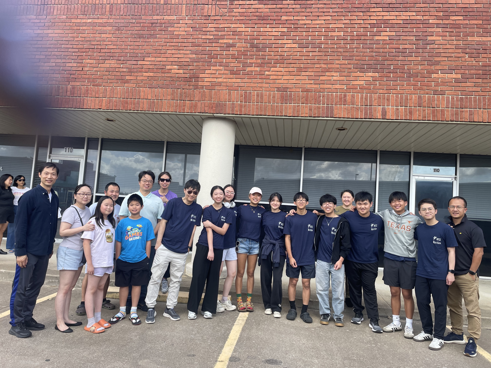

## NTCC Youth Ministry: Abide & Grow {#opening .photo-slide background-image="assets/ntcclockin2025_1.jpg" background-size="cover"}

::::::: hero-copy
::: eyebrow
State of the Youth Ministry + New Academic-Year Plan
:::

<h1>NTCC Youth Ministry: Abide & Grow</h1>


"Abide in Me, and I in you." — John 15:4 NKJV

::: {style="color: gold; margin-top:18px;"}
August 21, 2026 • Plan year: Aug 28, 2026–Jul 31, 2027
:::
:::::::

::: notes
\[Sources\]

- nextgen_2026_report.xlsx, studyplan sheet, rows 1–15.
- OpenAI ImageGen, “NextGen community,” generated for this presentation on 2026-08-21.
- John 15:4 NKJV (short excerpt supplied in the workbook).
:::

## A core is ready for intentional growth

::: eyebrow
Current state • as of August 21, 2026
:::

::: rule
:::

::::::::: metric-row
::::: metric
::: number
11
:::

::: label
Youth in grades 7–12  
:::
:::::

::::: metric
::: number
16
:::

::: label
College
:::
:::::

::::: metric
::: number
4
:::

::: label
Latest recorded Sunday attendance • Aug 16
:::
:::::

::::: metric
::: number
10
:::

::: label
DCCYC participants • Jun 10–14
:::
:::::

::::: metric
::: number
13
:::

::: label
Median weekly attendance across recorded totals
:::
:::::
:::::::::

::: callout-band
<strong>Ministry opportunity:</strong> turn a stable core into an inviting community where students belong, worship, grow, and lead.
:::

::: {.verse style="margin-top:28px;"}
“Let no one despise your youth, but be an example…” — 1 Timothy 4:12
:::

::: notes
\[Sources\]

- User-provided ministry counts: 11 youth as of 2026-08-21; DCCYC attendance 10.
- nextgen_2026_report.xlsx, attendance sheet, row 45 (latest total 16 on 2026-08-16; median of 32 recorded totals = 13).
- 1 Timothy 4:12 NKJV.
:::

## Attendance recovered in August after a disrupted summer

::: eyebrow
Weekly youth / NextGen attendance • Jan 4–Aug 16, 2026
:::

```{r}
#| fig-width: 13.4
#| fig-height: 4.55
#| out-width: "100%"
#| fig-align: center
library(ggplot2)

attendance <- data.frame(
  date = as.Date(c(
    "2026-01-04","2026-01-11","2026-01-18","2026-01-25",
    "2026-02-01","2026-02-08","2026-02-15","2026-02-22",
    "2026-03-01","2026-03-08","2026-03-13","2026-03-15","2026-03-22","2026-03-29",
    "2026-04-05","2026-04-12","2026-04-19","2026-04-26",
    "2026-05-03","2026-05-10","2026-05-17","2026-05-24","2026-05-31",
    "2026-06-07","2026-06-14","2026-06-21","2026-06-28",
    "2026-07-05","2026-07-12","2026-07-19","2026-07-26",
    "2026-08-02","2026-08-09","2026-08-16"
  )),
  total = c(17,14,18,11,17,13,13,14,13,15,16,13,13,12,16,14,12,17,14,15,12,11,14,13,4,10,8,8,10,10,11,12,14,16)
)

ggplot(attendance, aes(date, total)) +
  annotate("rect", xmin=as.Date("2026-06-08"), xmax=as.Date("2026-07-01"), ymin=-Inf, ymax=Inf, fill="#F2A93B", alpha=.10) +
  geom_hline(yintercept=13, color="#8B99A6", linewidth=.6, linetype="dashed") +
  geom_line(color="#0F2C46", linewidth=1.2, na.rm=TRUE) +
  geom_point(color="#0F2C46", fill="#FFFFFF", shape=21, size=3.3, stroke=1.2, na.rm=TRUE) +
  annotate("point", x=as.Date("2026-06-12"), y=10, color="#F2A93B", size=5, shape=18) +
  annotate("text", x=as.Date("2026-06-12"), y=11.5, label="DCCYC • 10", color="#9A5B00", fontface="bold", size=4.6) +
  annotate("text", x=as.Date("2026-08-16"), y=17.2, label="16", color="#0F2C46", fontface="bold", size=4.8) +
  scale_x_date(date_breaks="1 month", date_labels="%b", expand=expansion(mult=c(.015,.035))) +
  scale_y_continuous(breaks=seq(0,20,5), limits=c(0,20), expand=c(0,0)) +
  labs(x=NULL, y="Attendance", caption="Dashed line = median recorded attendance (13). Blank weeks remain gaps.") +
  theme_minimal(base_family="Arial", base_size=15) +
  theme(
    panel.grid.minor=element_blank(),
    panel.grid.major.x=element_blank(),
    panel.grid.major.y=element_line(color="#D8DEE5", linewidth=.45),
    axis.text=element_text(color="#5E6B78"),
    axis.title.y=element_text(color="#5E6B78", margin=margin(r=12)),
    plot.caption=element_text(color="#6A7681", hjust=0, margin=margin(t=10)),
    plot.margin=margin(8,18,4,8)
  )
```

:::::: {.three-col .small style="margin-top:-6px;"}
::: {}
<strong>Peak: 18</strong><br>[January 18]{.muted}
:::

::: {}
<strong>Summer signal</strong><br>[Family vacations, summer camps]{.muted}
:::

::: {}
<strong>August rebound</strong><br>[14 → 16 on Aug 9 and 16]{.muted}
:::
::::::

::: notes
\[Sources\]

- nextgen_2026_report.xlsx, attendance sheet, row 1 dates and row 45 totals.
- User-provided DCCYC attendance 10 for 2026-06-10 through 2026-06-14.
:::

## “Abide” gave the first half one discipleship language

::: eyebrow
Study plan • January–June 2026
:::

| Month | Monthly theme | Key Scripture | Ministry moment |
|------|----------------------|------------------|--------------------------|
| **Jan** | Abide in Christ | John 15:4–5 | New Year kickoff • Jan 4 |
| **Feb** | Abide in the Word | John 8:31–32 | Feb 20–21 |
| **Mar** | Abide in Prayer | Philippians 4:6–7 | Sports Day outreach • Mar 13 |
| **Apr** | Abide in Community | Hebrews 10:24–25 | Easter / Baptism • Apr 5 |
| **May** | Abide Through Obedience | John 15:10 |  |
| **Jun** | Abide in Trials | James 1:2–4 | DCCYC • Jun 10–14 |

::: callout-band
The sequence moves from <strong>connection with Christ</strong> to practices that sustain faith: Scripture, prayer, community, obedience, and perseverance.
:::

::: notes
\[Sources\]

- nextgen_2026_report.xlsx, studyplan sheet, rows 4–9.
- John 15:4–5; John 8:31–32; Philippians 4:6–7; Hebrews 10:24–25; John 15:10; James 1:2–4.
:::

## The fall turns abiding outward: fruit, love, courage, service, hope

::: eyebrow
Study plan • July–December 2026
:::

| Month | Monthly theme | Key Scripture | Ministry moment |
|------|----------------------|------------------|--------------------------|
| **Jul** | Abide in Grace | Romans 8:1 | Promotion Sunday • Jul 5 |
| **Aug** | Abide and Bear Fruit | John 15:8 | Back to School • Aug 9 |
| **Sep** | Abide in Love | John 13:34–35 | Relationship workshop • Sep 18 |
| **Oct** | Abide with Courage | Joshua 1:9 | Fall Festival outreach • Oct 30 |
| **Nov** | Abide in Humility & Service | Philippians 2:5–8 | Lock-in • Nov 20 |
| **Dec** | Abide in Hope | Proverbs 3:5–6 | Advent worship • Dec 13 |

::: callout-band
<strong>Fall emphasis:</strong> make spiritual fruit visible through welcome, service, witness, and student leadership.
:::

::: notes
\[Sources\]

- nextgen_2026_report.xlsx, studyplan sheet, rows 10–15.
- Romans 8:1; John 15:8; John 13:34–35; Joshua 1:9; Philippians 2:5–8; Proverbs 3:5–6.
:::

## DCCYC connects our youth to other young Christians in other churches.

:::::::::: {.two-col-4060 style="margin-top:54px; align-items:center;"}
::::: {}
::: big-ten
10
:::

::: big-ten-label
youth attended<br>DCCYC • Jun 10–14
:::
:::::

{width=750}
::::::::::

::: {.verse style="margin-top:56px;"}
"But we all, with unveiled face, beholding as in a mirror the glory of the Lord, are being transformed into the same image from glory to glory, just as by the Spirit of the Lord." — II Corinthians 3:18 (NKJV)

:::

::: notes
\[Sources\]

- User-provided DCCYC dates and attendance.
- 2 Timothy 3:14 NKJV.
:::

## The new year connects three rhythms around one mission

::: eyebrow
Academic year • Aug 28, 2026–Jul 31, 2027
:::

::: rule
:::

:::::::::::: {.three-col style="margin-top:54px;"}
::::: rhythm
::: step
01 • Connect
:::

<h3>Friday Fellowship</h3>

<p>A dependable front door for friendship, food, games, Scripture, small groups, and outreach.</p>

::: verse
Hebrews 10:24–25
:::
:::::

::::: rhythm
::: step
02 • Worship
:::

<h3>English Worship</h3>

<p>A steady Sunday rhythm where youth and college students hear Scripture, sing together, and serve.</p>

::: verse
Colossians 3:16
:::
:::::

::::: rhythm
::: step
03 • Grow
:::

<h3>Disciple + Send</h3>

<p>Personal invitations, consistent follow-up, leadership opportunities, and care for local and away students.</p>

::: verse
Matthew 28:19–20
:::
:::::
::::::::::::

::: notes
\[Sources\]

- User request, academic-year plan and mission goals.
- nextgen_2026_report.xlsx, Friday fellowship and English Worship sheets.
- Hebrews 10:24–25; Colossians 3:16; Matthew 28:19–20.
- The end date is shown as 2027 because it follows the supplied 2026 start date.
:::

## Friday Fellowship {#friday-fellowship .photo-slide background-image="assets/ivan-dimitrov-sX5GqBZ4vFU-unsplash.jpg" background-size="cover"}

::::: photo-panel
::: eyebrow
Friday Fellowship
:::

<h2>Friday nights become the front door</h2>

- **8** Fall Fridays from Aug 28–Dec 18
- **6** outreach anchors, plus kickoff
- Open weeks for games, Bible discussion, prayer, and student-led nights

::: {.gold .small style="margin-top:24px;"}
“Consider one another in order to stir up love and good works.” — Hebrews 10:24
:::
:::::

::: notes
\[Sources\]

- nextgen_2026_report.xlsx, Friday fellowship sheet, rows 1–18.
- OpenAI ImageGen, “Friday camp-out,” generated for this presentation on 2026-08-21.
- Hebrews 10:24 NKJV.
:::

## Seven anchor nights create natural invitation moments

::::::::::::::::::::::::::::: two-col-6040
::::::::::::::::::::::::: {}
:::::::::::::::::::::::: events-list
::::: event
::: date
Aug 28
:::

::: name
Kickoff Night
:::
:::::

::::: event
::: date
Sep 11
:::

::: name
Movie + Pizza
:::
:::::

::::: event
::: date
Sep 25
:::

::: name
Camp-out Night • Moon Festival
:::
:::::

::::: event
::: date
Oct 23
:::

::: name
Cook-out Night
:::
:::::

::::: event
::: date
Oct 30
:::

::: name
Fall Festival
:::
:::::

::::: event
::: date
Nov 20
:::

::: name
Lock-in
:::
:::::

::::: event
::: date
Dec 4
:::

::: name
Candlelight
:::
:::::
::::::::::::::::::::::::
:::::::::::::::::::::::::

::::: {}
::: {.flat-col .amber}
<h3>Repeatable open-Friday rhythm</h3>

<p><strong>Welcome game → meal → worship → Scripture → small groups → prayer</strong></p>

<p class="muted">

Game bank: Human Bingo, team relay, Bible escape challenge, and student-vs-leader minute games.

</p>
:::

::: callout-band
<strong>Outreach discipline:</strong> every anchor night gets an invitation goal, a welcome team, and a follow-up owner.
:::
:::::
:::::::::::::::::::::::::::::

::: notes
\[Sources\]

- nextgen_2026_report.xlsx, Friday fellowship sheet, rows 2–18.
- User request identifies the camp-out as the Moon Festival and lists the six outreach events.
- Hebrews 10:24–25 informs the fellowship-building rhythm.
:::

## English Worship {#english-worship .photo-slide background-image="assets/Lockinworship_2025.jpeg" background-size="cover"}

:::::: {.hero-copy style="margin-top:150px;"}
::: eyebrow
English Worship
:::

<h1>One worshiping community, every Sunday</h1>

::: subtitle
<strong>13 Sundays</strong> • Sep 13–Dec 6<br><strong>7 speakers</strong> • guest and in-house voices<br><strong>Students serving</strong> • welcome, music, Scripture, prayer, media
:::

::: scripture
“Teaching and admonishing one another… singing with grace.” — Colossians 3:16 NKJV
:::
::::::

::: notes
\[Sources\]

- nextgen_2026_report.xlsx, English Worship sheet, rows 1–13.
- User-provided guest and in-house speaker roster.
- OpenAI ImageGen, “English worship,” generated for this presentation on 2026-08-21.
- Colossians 3:16 NKJV.
:::

## A broad speaker bench supports a steady fall rhythm

:::::::::::: two-col
::::::: {}
::::: {.two-col style="gap:34px;"}
::: {.flat-col .amber}
<h3>Guest speakers</h3>

<ul class="speaker-list">

<li>Dr. Philip Koo</li>

<li>Kevin Du</li>

<li>Ryan Lin</li>

<li>Denis Kam</li>

<li>George Hue</li>

</ul>
:::

::: {.flat-col .skyline}
<h3>In-house speakers</h3>

<ul class="speaker-list">

<li>Steven Chin</li>

<li>Benson Lee</li>

<li>Karl Ho</li>

<li>Daniel Xiang</li>

</ul>
:::
:::::

::: callout-band
<strong>Confirmed in workbook:</strong> Sep 20 • Dr. Philip Koo. Assign the remaining dates and worship leaders before launch.
:::
:::::::

:::::: {}
:::: flat-col
<h3>2026 Fall Sundays</h3>

::: date-stack
<strong>September</strong> 13, 20, 27<br><strong>October</strong> 4, 11, 18, 25<br><strong>November</strong> 1, 8, 15, 22, 29<br><strong>December</strong> 6
:::
::::

::: song-line
<strong>Contemporary + Classics worship anchors:</strong> Great is Thy Faithfulness • Battle Belongs • God Is in This Story • Hymn of Heaven • I surrender all • Just That Good
:::
::::::
::::::::::::

::: notes
\[Sources\]

- nextgen_2026_report.xlsx, English Worship sheet, rows 1–13; workbook lists Philip Koo on 2026-09-20.
- User-provided speaker roster; user wording “Dr. Philip Koo” takes precedence over the workbook honorific.
- nextgen_20260816_compact.qmd, Worship slide and its linked contemporary worship materials.
- Song source links: https://www.youtube.com/watch?v=wHH_xH71IWI ; https://www.youtube.com/watch?v=johgSkNj3-A ; https://www.youtube.com/watch?v=R_zI1Iy5_EQ ; https://www.youtube.com/watch?v=bqxtFUwM3-o
:::

## Growth means widening the circle without losing discipleship depth

::: eyebrow
Mission targets • by the end of the academic year
:::

::::::::::::::::: goal-wrap
::::::::: goal
::::: goal-head
::: goal-name
Youth • grades 7–12
:::

::: goal-numbers
<strong>11 → 20</strong>   gap: +9
:::
:::::

:::: track
::: fill-youth
:::
::::

::: {.small .muted style="margin-top:9px;"}
55% of target today • growth needed: 82%
:::
:::::::::

::::::::: goal
::::: goal-head
::: goal-name
College
:::

::: goal-numbers
<strong>5 → 10</strong>   gap: +5
:::
:::::

:::: track
::: fill-college
:::
::::

::: {.small .muted style="margin-top:9px;"}
1 in town + 4 out of town • 50% of target today
:::
:::::::::
:::::::::::::::::

::: verse
“Grow up in all things into Him… from whom the whole body… causes growth.” — Ephesians 4:15–16
:::

::: notes
\[Sources\]

- User-provided mission counts and targets: youth 11 to 20; college 5 to 10, including 1 in town and 4 out of town.
- Calculations: youth 11/20 = 55% and gap 9; college 5/10 = 50% and gap 5.
- Ephesians 4:15–16 NKJV.
:::

## A simple pathway turns an invitation into belonging and leadership

::::::::::::: pathway
:::: path-step
::: num
01
:::

<h3>Invite</h3>

<p>Personal asks around high-interest outreach nights.</p>
::::

:::: path-step
::: num
02
:::

<h3>Welcome</h3>

<p>Name, host, introduce, and include every new student.</p>
::::

:::: path-step
::: num
03
:::

<h3>Follow up</h3>

<p>Contact student and parent within 48 hours.</p>
::::

:::: path-step
::: num
04
:::

<h3>Belong</h3>

<p>Connect to a small group, worship team, or service role.</p>
::::

:::: path-step
::: num
05
:::

<h3>Lead</h3>

<p>Coach students to welcome, testify, pray, teach, and serve.</p>
::::
:::::::::::::

::: callout-band
<strong>Track monthly:</strong> first-time guests • 30-day returners • average attendance • students serving • college check-ins
:::

::: {.verse style="margin-top:26px;"}
“Go therefore and make disciples…” — Matthew 28:19
:::

::: notes
\[Sources\]

- Recommended operating pathway developed from the user’s outreach, worship, and growth goals.
- Matthew 28:19–20 NKJV.
:::

## New team, New Sparks

::: eyebrow
Young Leaders, Exemplary Servants
:::


:::::::::::: two-col
::::::: {}
::::: {.two-col style="gap:34px;"}
::: {.flat-col .amber}
<h3>NextGen Committee</h3>

<ul class="speaker-list">

<li>President: Brian Hsieh (outgoing)</li>

<li>President: Jacob Liu (new term)</li>

<li>Vice President (Treasurer and Development): Jacqueline Chou</li>

<li>Vice President (Events and Outreach) Dorothy Pu </li>

</ul>
:::

::: {.flat-col .skyline}
<h3>Mentor and teacher team</h3>

<ul class="speaker-list">

<li>Karl Ho</li>

<li>Teacher: Steven Ching</li>

<li>Worship and Gamemaster: Daniel Xiang</li>

</ul>
:::
:::::

::: callout-band
<strong>It only takes a spark to get a fire going, And soon all those around can warm up to its glowing.  </strong>
:::
:::::::

:::::: {}
:::: flat-col
<h3>Worship team</h3>

<ul class="speaker-list">

<li>Daniel Xiang (percussions)</li>

<li>Karl Ho (AV and guitar)</li>

<li>Jacqueline Chou (keyboard/piano)</li>

<li>Dorothy Pu (vocal)</li>


</ul>

::::


::::::
::::::::::::

## The next step is alignment

::: eyebrow
Before the Aug 28 kickoff
:::

::: rule
:::

:::::::::::::::::: action-list
::::: action
::: check
01
:::

::: text
Confirm Friday event owners and the open-Friday fellowship rhythm.
:::
:::::

::::: action
::: check
02
:::

::: text
Assign every English Worship speaker and worship leader for Sep 13–Dec 6.
:::
:::::

::::: action
::: check
03
:::

::: text
Give each outreach night an invitation goal, welcome team, and follow-up owner.
:::
:::::

::::: action
::: check
04
:::

::: text
Create one monthly college touchpoint that includes both local and away students.
:::
:::::

::::: action
::: check
05
:::

::: text
Pray by name for the people behind the +9 youth and +5 college goals.
:::
:::::
::::::::::::::::::

::: closing-verse
“I planted, Apollos watered, but God gave the growth.” — 1 Corinthians 3:6 NKJV
:::

::: notes
\[Sources\]

- Actions synthesize the workbook schedules and user-provided growth targets.
- 1 Corinthians 3:6 NKJV.
:::
